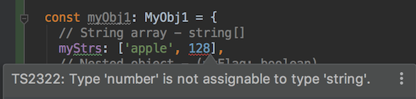
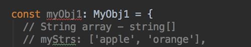
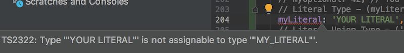
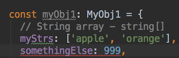

# ts-json-validator
[](https://circleci.com/gh/nwtgck/ts-json-validator)

Safer `JSON.parse()` validating by TypeScript types

Write a format of JSON once, Derive the type automatically in compile-time.

## Basic Usage

```ts
// Create a format
const personFormat = obj({
  name: str,
  age: num
});

// Generate Person type
// IMPORTANT: Type is derived in compile-time. Just a write format once!
type Person = TsType<typeof personFormat>;


// Safer parse than JSON.parse()
const p1: Person | undefined = validatingParse(personFormat, '{"name": "jack", "age": 8}');
```


```ts
const myObj: {[key: string]: any} = {name: "jack", age: 8};
const p2: Person | undefined = validate(personFormat, myObj);
// => not undefined
```

```ts
const myObj2: any = {name: "jack", age: "this is a text"};
isValid(personFormat.runtimeType, myObj2);
// => false (because type of age should be number)
```

## Example of Array/nested objects/Literal Types/Union Types/Tuples


```ts
// Create a format
const myObj1Format = obj({
  // String array - string[]
  myStrs: arr(str),
  // Nested object - (myFlag: boolean)
  myObj: obj({
    myFlag: bool
  }),
  // Union Type - string | number | bool
  strOrNumOrBool: union(str, num, bool),
  // Object array - {prop1: number, prop2: string}[]
  myObjs: arr(obj({
    prop1: num,
    prop2: str
  })),
  // Optional property（myOptional?: number）
  myOptional: opt(num),
  // Literal Type - (myLiteral: 'MY_LITERAL')
  myLiteral: literal('MY_LITERAL' as const),
  // Literal Union Type - ('red' | 'blue')
  myLitUnion: union(literal('red' as const), literal('blue' as const)),
  // Nullable - (string | null)
  myNullable: union(str, nul),
  // Tuple - [string, boolean, number]
  myTuple: tuple(str, bool, num),
});


// Generate MyObj1 type
// IMPORTANT: Type is derived in compile-time. Just write a format once!
type MyObj1 = TsType<typeof myObj1Format>;
```

In Union Type, `T1 | T2 | ... | T64` is supported. In tuple, `[T1, T2, ..., T64]` is supported.

## Type-safety

You can find errors in compile-time, not runtime!

### Wrong type in the array
`myStrs` should be an string array, but `128` is included.  


### Missing property
`myStrs` is required, but missing.  


### Wrong Literal Type
`myLiteral` should be `'MY_LITERAL'` type, but found `'YOUR LITERAL'`  


### Unknown property
Property `somethingElse` is not defined in `myObj1Format`.  

